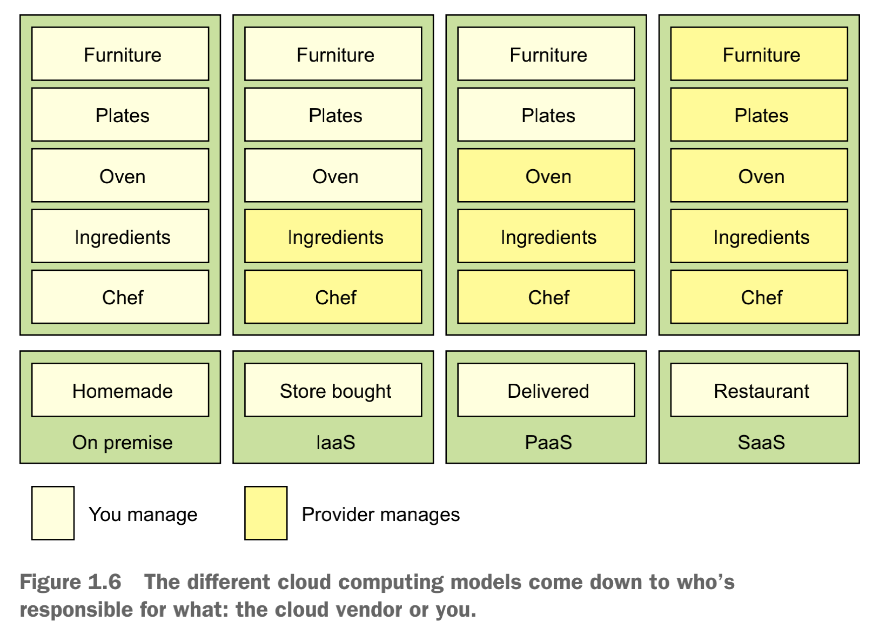
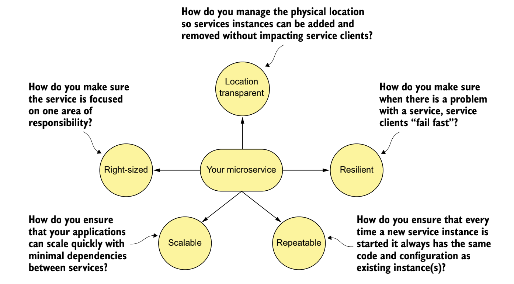
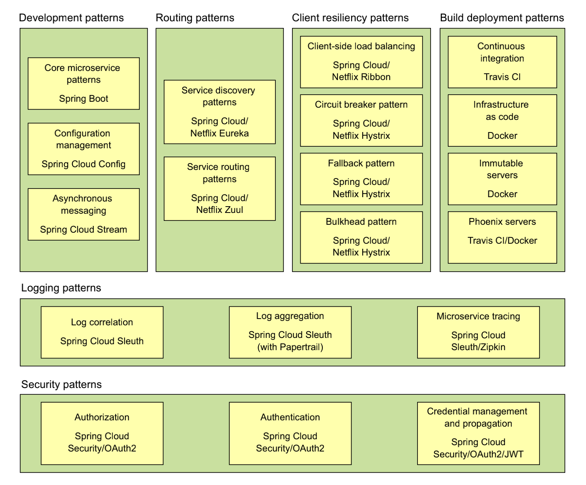

# Spring Microservices In Action by John Carnell (2017)

## Chapter 1

```
"Small, Simple, and Decoupled Services = Scalable, Resilient, and Flexible Applications" (p.13)
```

#### Cloud-Computing Models (p.13)

- IaaS Infrastructure as a Service
- PaaS Platform as a Service
- SaaS Software as a Service

#### Examples for these three cloud-computing models (p.13)

When you want to eat a meal, you have four choices:

1. You can make the meal at home. 
2. You can go to the grocery store and buy a meal pre-made that you heat up and serve.
3. You can get a meal delivered to your house.
4. You can get in the car and eat at restaurant.

</img>

#### Five Topics for Service Robustness (p.18)

- Right-sized
    - Service is properly sized, so that it doesn't take too much responsibilities.
- Location transparant
    - Manage physical details of service invocation.
- Resilient
    - Overal integrity of services, and ensure a 'fail-fast' approach.
- Repeatable
    - Every instances use same configuration and code base.
- Scalable
    - Async processing and events to minimise direct dependencies between services.  

</img>

#### Six Categories of Microservice Patterns (p.19)

- Core Developement Patterns
    - Service Granularity
    - Communication Protocols
    - Interface Designs
    - Configuration Management
    - Event Processing
- Routing Patterns
    - Service Discovery
    - Service Routing
- Client Resiliency Patterns
    - Client-side Load Balancing
    - Circuit Breakers Pattern
    - Fallback Pattern
    - Bulkhead Pattern
- Security Patterns
    - Authentication
    - Authorization
    - Credential Management and propagation
- Logging and Tracing Patterns
    - Log Correlation
    - Log Aggregation
    - Microservices Tracing
- Build and Deployment Patterns
    - Build and Deployment Pipeline
    - Infrastructure as Code
    - Immutable Servers
    - Phoenix Servers

#### Patterns Backed by Spring Cloud (p.27)

</img>

## Chapter 2

#### Incorporation Persepctives for Successful Microservices Development (p.38) 

- Architect: who foresee the big picture 
    - Decomposing business problems
    - Establishing service granularity
    - Defining service interfaces 

- Software Developer: who deliver microservices
- DevOps Engineer: who deploy microservices with consistency and repeatability in mind
    - Four Operational Lifecycle Steps
        1. Service Assembly
            - how service is packaged and deployed to guarantee repeatability and consistency.
        2. Service Bootstrapping 
            - how application and environment specific configuration is sperated from code, and how these configuration can be automatically and consistently applied without human intervention .
        3. Service Registration/Discovery
            - how new instances are registered and discovered automatically.
        4. Service Monitoring 
            - how instances are monitored, such that faulty microservices are detected, avoided (routing) and taken down.


p.56        


